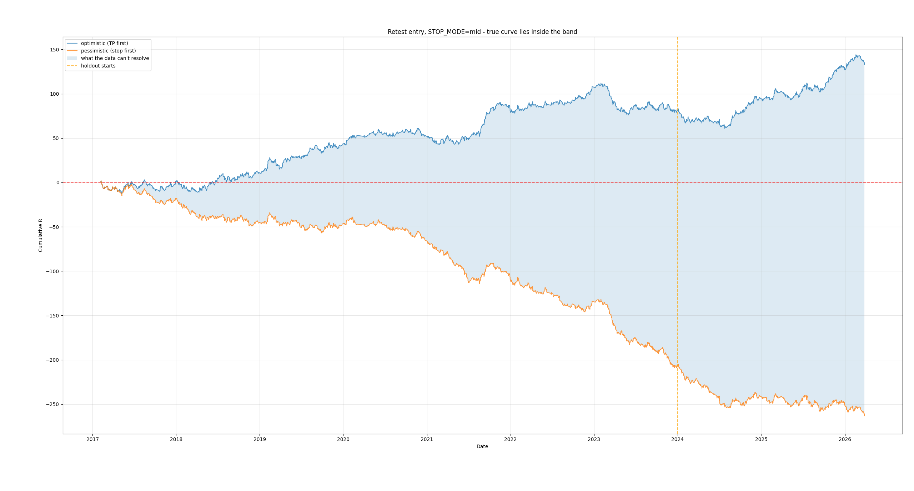

# ORB trading strategy — and why the data couldn't answer the question

A rule-based intraday Opening Range Breakout strategy in Python, with a live paper-trading bot and a backtest that reports its own measurement error.

**The strategy was discontinued.** Not because it lost, but because 5-minute OHLC data cannot resolve whether it wins or loses. The measurement uncertainty is larger than the effect being measured. This repo is kept as a record of how that was established.



Both curves above score identical trades. They differ only in how the 9.2% of bars that touch both the stop and the take profit are resolved — something the data cannot determine.

## The strategy

Trades QQQ, SPY, IWM and TQQQ on 5-minute bars through the Alpaca API.

1. The 09:30–09:35 bar defines the opening range
2. Skip the day if the range is under 0.10% wide, or the open gapped more than 0.7% from the previous close
3. Wait for a 5-minute close beyond the range — the breakout
4. Wait for a pullback to the broken level that still closes beyond it — the retest
5. Enter at the close of the next confirming candle, before 10:30
6. Stop at the breakout candle's midpoint, take profit at 1:1, risking 1% of equity per trade

## The measurement problem

When a single 5-minute bar's range spans **both** the take profit and the stop, OHLC data cannot tell you which was touched first. The bar only records that price visited both levels at some point during those five minutes.

Most backtests silently pick one. Checking take profit first awards every ambiguous outcome as a win, which inflates the result. Checking the stop first does the opposite.

This backtest refuses to pick. Every trade is scored twice:

- **Optimistic** — an ambiguous bar is a win
- **Pessimistic** — an ambiguous bar is a loss

The true result lies between. The gap between the bounds is the resolution of the instrument, and a conclusion is only meaningful when that gap is smaller than the effect being tested.

## Results

Retest entry, stop at the breakout candle midpoint:

| | Trades | Win rate | Total R | Ambiguous |
|---|---|---|---|---|
| Train 2017–2023 | 1,570 | 43.4% – 52.6% | −206 to +82 | 9.2% |
| Holdout 2024–2026 | 585 | 45.1% – 54.4% | −57 to +51 | 9.2% |
| All | 2,155 | 43.9% – 53.1% | −263 to +133 | 9.2% |

A 1:1 risk-reward strategy needs better than 50% to be profitable. The band straddles that threshold. **The data cannot say which side the strategy falls on.**

Bootstrap over the train period, 10,000 runs with replacement:

| | Median final R | Probability of profit |
|---|---|---|
| Pessimistic | −206R | 0.0% |
| Optimistic | +82R | 97.9% |

Identical trades. The strategy is either clearly unprofitable or almost certainly profitable, depending entirely on coinflips the data cannot resolve.

## Why the bars are ambiguous so often

The median stop distance is **$0.333 per share**, with 39% of trades under $0.26. At that tightness, a stop and a 1:1 take profit sit close enough together that a single 5-minute bar frequently spans both.

Stop placement is therefore partly a choice about measurability, not just about risk. Wider stops would produce fewer ambiguous bars and a narrower error band — `STOP_MODE = "extreme"` in `validation.py` tests this, placing the stop at the breakout candle's extreme instead of its midpoint for roughly double the distance.

Resolving the current configuration properly would need tick data, or at minimum 1-minute bars.

## The control arm

Removing the retest requirement and entering at the breakout close instead:

| | Trades | Win rate | Total R | Ambiguous |
|---|---|---|---|---|
| All | 5,051 | 39.5% – 58.6% | −1061 to +873 | 19.1% |

Worse on the pessimistic bound and far more ambiguous, since entering earlier means an even tighter stop. The retest filter does something — it roughly halves the ambiguity rate — but not enough to push the band clear of breakeven.

A widely repeated claim is that breakouts which never pull back outperform those that do. Splitting the control arm on whether a retest later occurred appears to support it (54.5% – 67.0% versus 30.5% – 53.3%), but the split is **biased by construction**: trades that resolve before a retest could have happened are automatically tagged "never retested". Reported here as suggestive only.

## Live paper trading

Roughly 28 trades to July 2026 at 42.9%, sitting at the pessimistic bound rather than the optimistic one. A small sample, but not encouraging.

## Methodology

- **Pre-registered.** Both arms and the comparison were specified before running. No variants added after seeing output.
- **Train/holdout split** at 2024-01-01, examined once.
- **Both arms share everything** except the entry rule — same filters, stop placement, sizing and evaluation.
- **Entry timing.** An earlier version entered at the retest candle close, five minutes before the signal actually completes. Corrected to the confirmation candle close.
- **Monte Carlo uses `replace=True`.** Sampling without replacement at full length is a permutation: every run sums to the same total, so "probability of profit" comes out at 100% by construction.
- **Self-flagged bias**, as noted in the retest split above.

## Repository layout

```
bot.py              Live paper-trading bot — streams bars, detects setups, places bracket orders
replay.py           Replays a single historical day through bot.py's logic
validation.py       Backtest with dual scoring, bootstrap and equity curves
config.py           API keys (not tracked)
requirements.txt
docs/               Plots
```

## Setup

```bash
git clone https://github.com/RG1579/quant-alg.git
cd quant-alg
pip install -r requirements.txt
```

Create `config.py`:

```python
base_url = 'https://paper-api.alpaca.markets/v2'
api_key = '...'
secret_key = '...'
historical_base = 'https://data.alpaca.markets/{version}'
```

Then:

```bash
python bot.py           # live paper trading
python replay.py        # replay one historical day
python validation.py    # backtest, bootstrap, plots
```

## Known issues

- `place_order` passes `limit_price` to `MarketOrderRequest`, left over from switching from limit to market orders. The field does not exist on that class and should be removed.
- `replay.py` computes a `bullish` flag that nothing consumes, left from a removed directional filter.
- Slippage is unmeasured. `bot.py` logs the intended entry but not the actual fill. Against a median stop of $0.33, a few cents matters.

## Disclaimer

For educational purposes only. Not financial advice.
